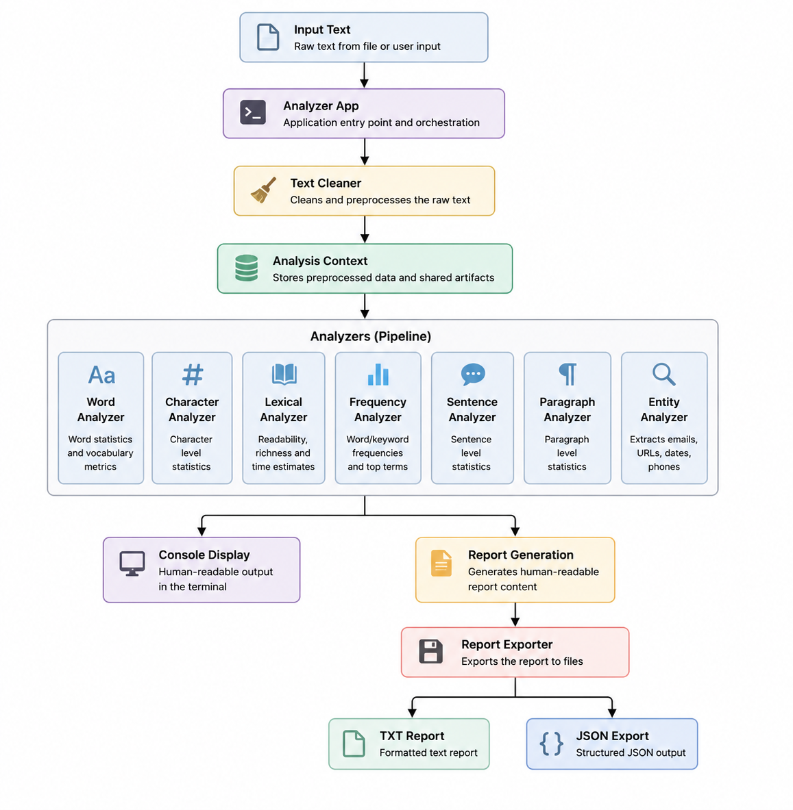

# 🧠 Text Analyzer System
A modular Python-based text analysis system built using object-oriented design, layered architecture, and automated testing practices. 
The application processes raw text through an extensible analyzer pipeline, extracts structured insights, and generates both human-readable reports and machine-readable JSON output.

The project evolved from a simple text analysis script into a fully tested software system featuring reusable analyzers, shared execution contexts, report generation, automated regression testing, and GitHub Actions continuous integration.

---

## 🎯 About This Project

This project began as a simple text analysis script and gradually evolved into a structured software system through **continuous refactoring**, **architectural improvements**, and **iterative feature development**.

The system is built around a modular analyzer pipeline, shared execution context, dedicated reporting layer, and export mechanisms for generating both human-readable reports and structured JSON output.

Beyond text analysis, the project serves as a practical learning platform for applying software engineering concepts such as object-oriented programming, layered architecture, testing, continuous integration, configuration management, and maintainable code design through real-world implementation.

---

## ✨ Features

### 📊 Core Analysis
* Total word count and unique word count
* Longest word detection
* Character statistics (with and without spaces)
* Sentence analysis and readability metrics
* Paragraph analysis

### 📈 Lexical Insights
* Vocabulary richness scoring (Type-Token Ratio)
* Vocabulary quality assessment
* Estimated reading time
* Estimated speaking time

### 🏷️ Entity Extraction
* Email address extraction
* URL extraction
* Date extraction
* Phone number extraction

### 💾 Reporting & Export
* Human-readable text report generation
* Structured JSON export
* UTF-8 encoded output support

### 🧪 Quality Assurance
* 155 automated tests
* 99% code coverage
* Unit and integration testing
* GitHub Actions continuous integration
* Automated validation on every push and pull request

---

## 🏗️ Architecture

The Text Analyzer System follows a modular, layered architecture centered around a shared execution context and an extensible analyzer pipeline. Each component has a single responsibility, making the system easier to test, maintain, and extend.



---

## 📂 Project Structure

```text
Text-Analyzer-System/
│
├── .github/
│   └── workflows/
│       └── python-tests.yml
│
├── assets/
│   ├── architecture.png
│   └── sample_report.png
│
├── tests/
│   ├── test_app.py
│   ├── test_character_analyzer.py
│   ├── test_entity_analyzer.py
│   ├── test_frequency_analyzer.py
│   ├── test_lexical_analyzer.py
│   ├── test_paragraph_analyzer.py
│   ├── test_sentence_analyzer.py
│   ├── test_text_cleaner.py
│   └── test_word_analyzer.py
│
├── inputs/
│   └── raw_text.txt
│
├── results/
│   ├── analysis.json
│   └── text_analysis.txt
│
├── config.py
├── main.py
├── text_analyzer.py
├── report_generator.py
├── ui.py
├── requirements.txt
├── README.md
├── LICENSE
└── .gitignore
```

---

## ⚙️ Installation
Clone the repository:

```bash
git clone https://github.com/manaalroshan/Text-Analyzer-System.git
cd Text-Analyzer-System
```

Install dependencies:

```bash
pip install -r requirements.txt
```

---

## 🚀 Usage

### Analyze a Text File

Place your text file inside the `inputs/` directory.

Example:

```text
inputs/
└── raw_text.txt
```

Run the application:

```bash
python main.py
```

The analysis results will be generated in:

```text
results/
├── analysis.json
└── text_analysis.txt
```

### Manual Text Input

If no input file is found, the application automatically switches to manual input mode.

Enter your text directly into the terminal and press Enter to begin analysis.

---

## 🧪 Running Tests

Execute the complete test suite:

```bash
python -m pytest
```

Run tests with coverage reporting:

```bash
python -m pytest --cov
```

Current test suite:

- 155 automated tests
- 99% code coverage
- GitHub Actions CI validation

---

## 🛠️ Technologies Used

* **Python 3.13** – Core programming language
* **Pytest** – Automated testing framework
* **Pytest-Cov** – Code coverage reporting
* **Git** – Version control
* **GitHub** – Repository hosting and collaboration
* **GitHub Actions** – Continuous Integration (CI)
* **JSON** – Structured data export format
* **Pathlib** – Cross-platform file system handling
* **Regular Expressions (Regex)** – Pattern matching and text extraction

## 🧩 Concepts Demonstrated

### Software Design
- Object-Oriented Programming (OOP)
- Abstraction using Abstract Base Classes (ABC)
- Polymorphism
- Separation of Concerns (SoC)
- Layered Architecture
- Single Responsibility Principle (SRP)
- Pipeline-Based Processing

### Python Development
- Static Methods
- Dictionaries and Collections
- List Comprehensions
- Exception Handling
- File Handling
- JSON Serialization
- Regular Expressions

### Testing & Quality Assurance
- Unit Testing
- Integration Testing
- Parametrized Testing
- Fixtures
- Exception Testing
- Code Coverage Analysis

### Continuous Integration (CI)
- Development Workflow
- Feature Branch Workflow
- Automated Test Pipelines
- Versioned Releases

---

## 📚 What I Learned

Through building this project I gained practical experience with:

- Object-Oriented Programming (OOP)
- Layered Software Architecture
- Refactoring Legacy Code
- Regular Expressions
- Automated Testing with Pytest
- Code Coverage Analysis
- Git & GitHub Workflows
- Continuous Integration using GitHub Actions
- Documentation and Project Maintenance

The project evolved from a simple script into a modular and fully tested software system through iterative development and continuous improvement.

---

## 🔮 Future Improvements

Potential future enhancements include:

- Advanced readability analysis
- Pandas-based data analysis features
- Database integration
- Web interface
- Interactive visualizations
- API support

---

## 📜 License
This project is licensed under the MIT License. See the LICENSE file for details.
